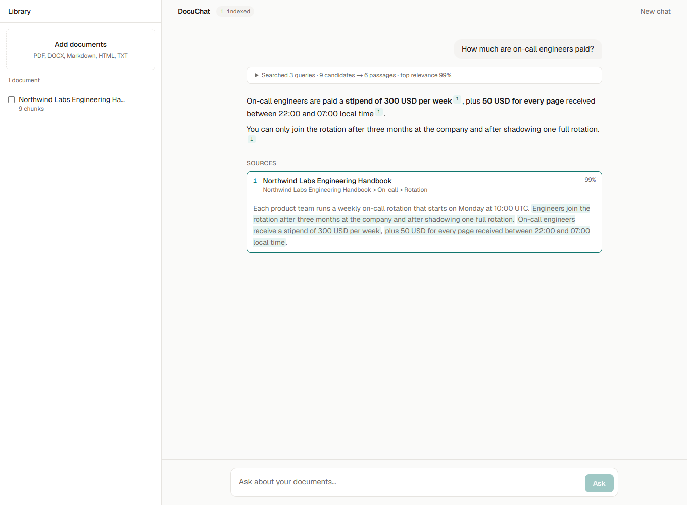
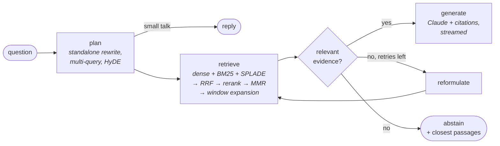

# DocuChat

**Grounded answers from your documents, with citations.** Upload PDFs, Word files, Markdown or HTML and ask questions. DocuChat combines three retrievers, reranks the candidates with a cross-encoder, checks that the evidence is actually relevant, and has Claude answer with **native citations** that point to the exact sentences it used. If the documents don't cover the question, it says so instead of guessing.

[](https://github.com/LeonAchata/DocuChat-AI/actions/workflows/ci.yml)




## What's inside

| Stage | Technique | Why it matters |
| --- | --- | --- |
| Parsing | PDF (font-size heading detection, page tracking), DOCX (styles and tables), Markdown, HTML, TXT | Chunks know their page and section, so citations can say *"p. 12 · Methods > Sampling"*. |
| Chunking | Structure-aware: never crosses sections, token budget, sentence-level overlap | Coherent chunks retrieve and read better than fixed windows of words. |
| Contextual retrieval *(optional)* | Claude writes a 1–2 sentence context per chunk ([Anthropic's technique](https://www.anthropic.com/news/contextual-retrieval)); the full document is prompt-cached | Chunks like *"revenue grew 3%"* become findable ("…of ACME in Q2 2025"). |
| Query understanding | One structured LLM call: standalone rewrite of follow-ups, multi-query expansion, and a HyDE hypothetical answer | Recall for vague, conversational or multi-part questions. |
| Hybrid retrieval | **Dense** (bge, ONNX) + **BM25** / Postgres full-text + **SPLADE** learned sparse, per query variant | Semantic matching plus exact terms (IDs, names, acronyms). |
| Fusion | Weighted **Reciprocal Rank Fusion** | Combines rankings with incomparable score scales without calibration. |
| Reranking | **Cross-encoder** (MiniLM / bge / jina rerankers) on the top 40 | Big precision gain at the top of the list. |
| Diversification | **MMR** on the reranked pool | Spends the context window on different evidence, not near-duplicates. |
| Context assembly | Neighbour-window expansion within the same section, merged into passages; overlap de-duplicated | Enough surrounding text to answer, without mixing unrelated sections. |
| Corrective loop | Relevance gate on the reranker score, then reformulate and retry, then **abstain** | Fewer confident hallucinations when the answer isn't in the documents. |
| Generation | Claude with **native citations** (`citations: {enabled: true}`), streamed token by token | Every claim links to the exact supporting sentence, highlighted in the UI. |

It is built as a LangGraph state machine with per-thread memory:



## Retrieval benchmark

Measured on [BEIR SciFact](https://github.com/beir-cellar/beir) (5,183 scientific abstracts, 300 test queries). Everything runs locally on CPU through ONNX, with no LLM calls. Reproduce with `docuchat eval`.

<!-- BENCHMARK:START -->
_Results pending._
<!-- BENCHMARK:END -->

## Quick start

### Docker (Postgres + pgvector)

```bash
export ANTHROPIC_API_KEY=sk-ant-...
docker compose up --build
```

Open <http://localhost:3000> and drop in a file. [`samples/`](samples/) has one to try. The embedding, SPLADE and reranker models are baked into the API image.

### Local development

```bash
cd backend
uv sync --all-extras
cp ../.env.example .env                 # set ANTHROPIC_API_KEY
uv run docuchat ingest ../samples       # index files or folders
uv run docuchat ask "How much are on-call engineers paid?"
uv run docuchat serve --reload          # API on :8000

cd ../frontend && npm install && npm run dev   # UI on :3000
```

With the default `DOCUCHAT_STORE=memory`, the index lives on disk under `backend/data/` (numpy, JSON). Set `DOCUCHAT_STORE=postgres` to use pgvector: HNSW for dense vectors, `sparsevec` HNSW for SPLADE and a generated `tsvector` with a GIN index for full-text search.

### CLI

| Command | What it does |
| --- | --- |
| `docuchat ingest PATH…` | Parse, chunk, embed and index files or folders (content-addressed, so re-ingesting is a no-op) |
| `docuchat documents` | List indexed documents |
| `docuchat ask "…"` / `docuchat chat` | One-shot or multi-turn Q&A with sources |
| `docuchat serve` | HTTP API |
| `docuchat eval --dataset scifact` | Retrieval benchmark on a BEIR dataset |
| `docuchat download-models` | Pre-fetch the ONNX models |

## Configuration

Environment variables prefixed with `DOCUCHAT_`. See [`.env.example`](.env.example).

| Variable | Default | |
| --- | --- | --- |
| `STORE` | `memory` | `memory` or `postgres` |
| `DENSE_MODEL` | `BAAI/bge-small-en-v1.5` | Multilingual: `intfloat/multilingual-e5-large` |
| `SPARSE_MODEL` | `prithivida/Splade_PP_en_v1` | Empty to disable |
| `RERANKER_MODEL` | `Xenova/ms-marco-MiniLM-L-12-v2` | Multilingual: `jinaai/jina-reranker-v2-base-multilingual` |
| `CHUNK_TOKENS` / `CHUNK_OVERLAP_TOKENS` | `320` / `48` | |
| `TOP_K` | `6` | Chunks kept after rerank + MMR |
| `WEIGHT_DENSE` / `WEIGHT_LEXICAL` / `WEIGHT_SPARSE` | `1.0` each | RRF weights |
| `MMR_LAMBDA` | `0.75` | 1.0 = relevance only |
| `MIN_RELEVANCE` | `0.02` | Reranker probability below which evidence counts as insufficient |
| `QUERY_EXPANSION` | `true` | Multi-query + HyDE |
| `CONTEXTUALIZE` | `false` | Contextual retrieval at ingestion (extra LLM cost) |
| `MODEL` / `EFFORT` | `claude-opus-5-5` / `medium` | |

## API

| Method | Path | |
| --- | --- | --- |
| `POST` | `/api/documents` | Multipart upload (one or more files). Returns `202`; indexing runs in the background. |
| `GET` | `/api/documents` | Documents with status (`processing`, `ready`, `failed`) |
| `DELETE` | `/api/documents/{id}` | Remove a document and its chunks |
| `POST` | `/api/chat` | `{message, thread_id?, document_ids?}`. Returns an SSE stream of `thread`, `plan`, `retrieval`, `reformulate`, `delta`, `citation`, `answer` and `done` events. |
| `GET` | `/api/threads/{id}` | Conversation history with sources |

## Engineering

- **Typed and tested.** `mypy --strict` and ruff pass. The test suite covers parsers (including generated PDFs and DOCX files), chunking, BM25/RRF/MMR maths, the store contract, the agent graph, the Claude adapter (against a fake Messages API that emits real SSE, citations included) and the HTTP API. Tests use deterministic hashing encoders, so they need no model downloads or API key.
- **Postgres tested for real.** CI runs the same store contract tests against a `pgvector/pgvector` service container.
- **Pluggable.** Stores, encoders, rerankers and the LLM sit behind small protocols.

```
backend/src/docuchat/
  ingest/       parsers.py, chunker.py, pipeline.py
  index/        encoders.py (fastembed ONNX + test doubles), memory.py (numpy + BM25), postgres.py (pgvector)
  retrieval/    retriever.py (hybrid pipeline), fusion.py (RRF, MMR)
  generation/   claude.py (query planning, contextualization, cited streaming answers)
  agent.py      LangGraph corrective-RAG graph
  api.py, cli.py, evals.py
frontend/       Next.js 16: library with drag-and-drop upload, streamed answers, clickable citations
```

## License

MIT © Leon Achata
